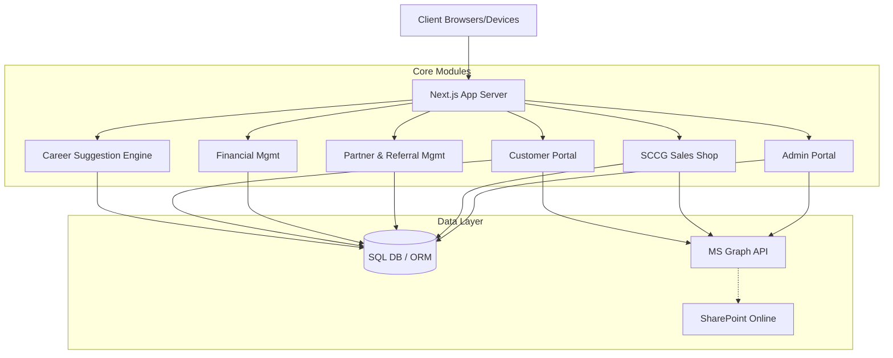

# SCCG Portal System Architecture & Design Document

## 1. High-Level System Architecture

### Technology Stack
*   **Frontend**: Next.js 15 (App Router), React 19, Tailwind CSS, shadcn/ui.
*   **Backend**: Next.js Server Actions & API Routes (Node.js edge/serverless runtime).
*   **Data Storage (Hybrid Approach)**: 
    *   **SharePoint Online (via MS Graph API)**: Document management, workflow tracking (automations via Power Automate), and lightweight lists (e.g., News/Promotions).
    *   **PostgreSQL / SQL Server**: High-transaction relational data (Orders, Financials, Users, Career Profiles, telemetry). *Justification: SQL is vastly superior to SharePoint for aggregations, complex joins (financial reporting), and rapid transactional consistency required for a B2B e-commerce shop.*
*   **Authentication & User Management**: **Firebase Authentication**. Firebase will serve as the master identity provider for ALL users (admins, partners, experts, and customers).
    *   *Implementation*: We will use the Firebase Admin SDK to issue custom claims (e.g., `role: "admin" | "partner" | "customer"`) to strictly enforce Role-Based Access Control (RBAC) securely across the Next.js backend. User profiles and metadata will sync between Firebase and the SQL/SharePoint data layer.

### Modular Architecture Structure

---

## 2. Data Model & Tables

This system utilizes a relational SQL database structured into three schemas to separate logical concerns: `identity`, `commerce`, and `insights`.

**Total Number of Tables:** 22
**Schemas Used:** `identity` (Users/Roles), `commerce` (Shop/Admin/Finance), `insights` (Career/Suggestions/Docs)

### Schema: `identity`

#### 1. Users
| Column | Type | Description |
| :--- | :--- | :--- |
| `id` (PK) | UUID | Unique identifier |
| `email` | String | Login email |
| `passwordHash` | String | Encrypted password |
| `roleId` (FK) | UUID | Link to Roles table |
| `createdAt` | DateTime| Timestamp |

#### 2. RolesPermissions
| Column | Type | Description |
| :--- | :--- | :--- |
| `id` (PK) | UUID | Unique identifier |
| `name` | Enum | admin, partner, expert, customer |
| `permissions` | JSONB | Granular access rights matrix |

#### 3. Partners (Extends Users)
| Column | Type | Description |
| :--- | :--- | :--- |
| `id` (PK) | UUID | References Users.id |
| `company` | String | Partner organization name |
| `status` | Enum | pending, active, suspended |

#### 4. Experts (Extends Users)
| Column | Type | Description |
| :--- | :--- | :--- |
| `id` (PK) | UUID | References Users.id |
| `skills` | String[] | Core competencies |
| `hourlyRate` | Decimal| Default billing rate |

#### 5. Clients / Customers (Extends Users)
| Column | Type | Description |
| :--- | :--- | :--- |
| `id` (PK) | UUID | References Users.id |
| `managedBy` (FK)| UUID | Partner ID who onboarded them (optional) |
| `company` | String | Client organization |

### Schema: `commerce`

#### 6. Products
| Column | Type | Description |
| :--- | :--- | :--- |
| `id` (PK) | UUID | Unique identifier |
| `name` | String | Product Name |
| `description` | Text | Full details |
| `basePrice` | Decimal| Standard B2B price |
| `isActive` | Boolean | Visibility toggle |

#### 7. Promotions
| Column | Type | Description |
| :--- | :--- | :--- |
| `id` (PK) | UUID | Unique identifier |
| `title` | String | Display name |
| `discountType` | Enum | fixed, percent |
| `discountValue` | Decimal| Value of discount |
| `targetProductId`(FK)| UUID | Limits promo to specific item (optional) |

#### 8. SalesOffers (Header)
| Column | Type | Description |
| :--- | :--- | :--- |
| `id` (PK) | UUID | Unique identifier |
| `offerNumber` | String | e.g. SO-2024-001 |
| `creatorId` (FK)| UUID | User who created it |
| `clientId` (FK) | UUID | Target client |
| `totalAmount` | Decimal| Final price with discounts |
| `status` | Enum | draft, sent, accepted, rejected |

#### 9. SalesOfferItems (Lines)
| Column | Type | Description |
| :--- | :--- | :--- |
| `id` (PK) | UUID | Unique identifier |
| `offerId` (FK) | UUID | Belongs to SalesOffer |
| `productId` (FK)| UUID | Product identifier |
| `quantity` | Int | Amount |
| `unitPrice` | Decimal| Price at time of offer |

#### 10. SalesOrders (Header)
| Column | Type | Description |
| :--- | :--- | :--- |
| `id` (PK) | UUID | Unique identifier |
| `orderNumber` | String | e.g. ORD-2024-001 |
| `offerId` (FK) | UUID | Derived from SalesOffer |
| `status` | Enum | pending, in-progress, completed |

#### 11. SalesOrderItems (Lines)
| Column | Type | Description |
| :--- | :--- | :--- |
| `id` (PK) | UUID | Unique identifier |
| `orderId` (FK) | UUID | Belongs to SalesOrder |
| `productId` (FK)| UUID | Product identifier |

#### 12. Referrals
| Column | Type | Description |
| :--- | :--- | :--- |
| `id` (PK) | UUID | Unique identifier |
| `referrerId`(FK)| UUID | Partner who referred |
| `orderId` (FK) | UUID | Order generating commission |
| `commissionPct` | Decimal| Percentage cut |

#### 13. FinancialTransactions
| Column | Type | Description |
| :--- | :--- | :--- |
| `id` (PK) | UUID | Unique identifier |
| `type` | Enum | income, expense |
| `amount` | Decimal| Transaction value |
| `orderId` (FK) | UUID | Related order (optional) |
| `recordedAt` | DateTime| When transaction occurred |

#### 14. Payouts
| Column | Type | Description |
| :--- | :--- | :--- |
| `id` (PK) | UUID | Unique identifier |
| `partnerId` (FK)| UUID | Target partner |
| `amount` | Decimal| Total sent |
| `status` | Enum | pending, processing, paid |

#### 15. Budgets
| Column | Type | Description |
| :--- | :--- | :--- |
| `id` (PK) | UUID | Unique identifier |
| `yearMonth` | String | e.g. "2024-10" |
| `targetIncome` | Decimal| Expected revenue |
| `targetExpense` | Decimal| Maximum planned cost |

#### 16. Services (Service Tasks)
| Column | Type | Description |
| :--- | :--- | :--- |
| `id` (PK) | UUID | Unique identifier |
| `orderId` (FK) | UUID | Parent order |
| `expertId` (FK) | UUID | Assigned expert |
| `status` | Enum | unassigned, active, QA, done |

#### 17. NewsSlider
| Column | Type | Description |
| :--- | :--- | :--- |
| `id` (PK) | UUID | Unique identifier |
| `imageUrl` | String | Hero image |
| `headline` | String | Slide title |
| `targetUrl` | String | Click destination |

### Schema: `insights`

#### 18. CareerProfiles
| Column | Type | Description |
| :--- | :--- | :--- |
| `id` (PK) | UUID | References Users.id (Customers) |
| `currentRole` | String | User's job title |
| `industry` | String | Operating sector |

#### 19. CareerGoals
| Column | Type | Description |
| :--- | :--- | :--- |
| `id` (PK) | UUID | Unique identifier |
| `profileId` (FK)| UUID | Target user |
| `targetTitle` | String | The desired future role |
| `targetDate` | DateTime| Desired completion |

#### 20. CareerPredictions (AI Authored)
| Column | Type | Description |
| :--- | :--- | :--- |
| `id` (PK) | UUID | Unique identifier |
| `goalId` (FK) | UUID | Target Goal |
| `suggestedSkills`| String[] | JSON array of skills to learn |
| `productId` (FK)| UUID | Suggested training/product map |

#### 21. SystemDocumentation
| Column | Type | Description |
| :--- | :--- | :--- |
| `id` (PK) | UUID | Unique identifier |
| `title` | String | Doc title |
| `markdownBody`| Text | The content |
| `authorId` (FK) | UUID | Admin who wrote it |
| `lastUpdated` | DateTime| For version tracking |

#### 22. DocVersions
| Column | Type | Description |
| :--- | :--- | :--- |
| `id` (PK) | UUID | Unique identifier |
| `docId` (FK) | UUID | Parent document |
| `markdownBody`| Text | The historical content |

> [!CAUTION]
> **Data Flow Diagram**
> User (1) → (N) SalesOffers (1) → (N) SalesOfferItems
> SalesOffers (1) → (1) SalesOrders (1) → (N) Services
> SalesOrders (1) → (N) FinancialTransactions

---

## 3. Admin Portal Documentation Module

To prevent architecture documentation from becoming stale and lost in external wikis, the SCCG Admin Portal will house a live **System Documentation Hub**.

*   **Storage**: Driven by the `SystemDocumentation` and `DocVersions` tables. Content is saved as raw Markdown.
*   **Rendering**: Uses a dynamic markdown renderer (e.g., `react-markdown` with `remark-gfm` and `rehype-raw` plugins) capable of rendering tables, callouts, and Mermaid JS charts directly inside the Next.js admin layout.
*   **Admin UX**: Includes a split-pane Markdown editor. When an admin hits "Save", a trigger captures the difference, pushes the old body to `DocVersions`, updates `lastUpdated`, and sets `authorId` to the active session user.

---

## 4. UI/UX Design (Modern, Graphical, 3D Feel)

The platform will move away from standard "flat" enterprise UI to a rich, premium **Neumorphic / Glassmorphic Hybrid** design.

*   **Design Language**: "Cosmic Glass"
    *   **Color Palette**: Deep space backgrounds (Dark slate/obsidian) contrasting with vibrant, fluorescent accent gradients (cyan, amethyst, neon coral).
    *   **Components**: 
        *   **Cards**: Translucent backgrounds (`bg-white/5` with `backdrop-blur-xl`), subtle 1px borders, and soft outer glows to create a 3D "floating" effect.
        *   **Charts**: Area charts with vertical 3D gradient fills.
        *   **Typography**: Clean sans-serif (e.g., *Inter* or *Outfit*) with bold weights for numbers and tracking-wide for section headers.
*   **Area Breakdown**:
    *   **SCCG Sales Shop**: Masonry grid galleries. Product cards feature 3D hover lifting effects. The News Slider uses full-bleed imagery with heavy bottom-up text gradients.
    *   **Financial Dashboard**: Dark mode focused. Massive central "Net Income" donut chart mimicking a glowing neon ring. Payout tables use alternating row opacities instead of solid borders.
    *   **Customer Portal**: Lighter, friendlier aesthetic. Milestones presented as dynamic, animated step-bars.

---

## 5. Customer Portal & Career Goal Features

### Customer Portal Dashboards
1.  **"My Vault"**: A centralized library showing purchased products/courses. Clicking an item slides open a drawer with license keys and associated expert contacts.
2.  **Service Tracker**: A FedEx-style tracker for active service tasks (e.g., *Phase 1: Planning → Phase 2: Execution → Phase 3: QA*).

### Career Goal & Suggestion Engine (AI Driven)
This module bridges e-commerce with actionable consulting.
*   **The Flow**: 
    1. Customer fills out a "Career Compass" survey.
    2. Data hits the `CareerProfiles` and `CareerGoals` tables.
    3. An async cron job (or server action) feeds this profile to an AI (via OpenAI/Anthropic API).
    4. The AI returns a structured JSON payload predicting the user's necessary trajectory.
    5. The engine maps the AI's suggested skills to `Products.id` in the SCCG shop.
*   **The UX**: Displayed as a "Skill Tree" (like an RPG video game). Nodes represent skills. Gray nodes are unlearned. Clicking an unlearned node pops up the SCCG product/service designed to teach that skill.

---

## 6. Future Extensions & Notes
*   **Notifications Engine**: Consider adding an `AppNotifications` table later to handle WebSockets or Server-Side Events (SSE) for real-time alerts when a Sales Offer is accepted.
*   **Multi-tenant Scaling**: If the partner network scales globally, consider row-level security (RLS) in PostgreSQL based on the `tenant_id` or `partner_id` to strictly segment data physically at the database level.
