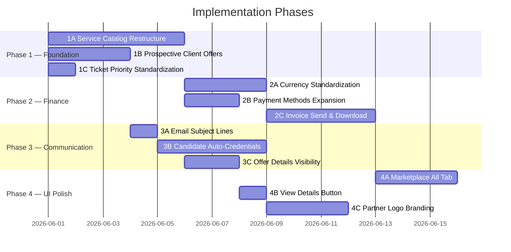

# SCCG Partner Portal — Improvement Plan

> Based on colleague feedback review (May 2026)  
> Organized into 4 implementation phases, prioritized by dependency and impact.

---

## Phase 1: Data Model & Service Catalog Restructure
**Estimated scope: Foundation changes that other phases depend on**

### 1A. Restructure Service Pricing Catalog (Feedback #2)

**Current state:** `src/lib/data/service-pricing.ts` has 4 workflow categories (Training, Ausbildung, Student Visa, Opportunity Card) with `packageType: "all-inclusive" | "premium-bundle" | "add-on"` labels.

**Required changes:**

| File | Change |
|------|--------|
| `src/types/index.ts` | Add `"Others"` to `WorkflowCategory` union type. Rename `"Training"` → `"Training & Language"`, `"Student Visa"` → `"Student"`. Add new `ServicePackageType` value or remove Premium/Standard labels entirely. |
| `src/lib/data/service-pricing.ts` | **Complete rewrite** of `SERVICE_PRICING_DATA` to match new categories: |

**New service catalog:**

```
🔹 Training & Language (renamed from "Training")
  - Profile Assessment — 30 EUR (add-on)
  - Advanced Job Application Training — 190 EUR (add-on)
  - Advanced Student Preparation — 190 EUR (add-on)
  - Language Courses: A1, A2, B1, A1–A2, A1–B2 Intensive (keep current)

🔹 Ausbildung (keep name)
  - All Inclusive (keep current all-inclusive package)
  - Job Application Training — 190 EUR (add-on)
  - Visa Support — 120 EUR (add-on)
  ❌ Remove "Premium" / "Standard" labels from UI

🔹 Opportunity Card (keep name)
  - All Inclusive (keep current all-inclusive package)
  - Job Application Training — 190 EUR (add-on)
  - Opportunity Card Application Submission — 250 EUR (add-on)
  - Visa Support — 120 EUR (add-on)
  ❌ Remove "Premium" / "Standard" labels from UI

🔹 Student (renamed from "Student Visa")
  - All Inclusive (keep current all-inclusive package)
  - Advanced Application Preparation — 190 EUR (add-on)
  - Visa Support — 120 EUR (add-on)
  ❌ Remove "Premium" / "Standard" labels from UI

🔹 Others (NEW category)
  - Translation Service — 30 EUR per page (add-on)
  - Visa Support — 120 EUR (add-on)
```

**Files to update after rename:**
- `src/types/index.ts` — `WorkflowCategory` type, all status type references
- `src/lib/data/service-pricing.ts` — entire data array
- `src/app/partner/candidates/new/WizardShell.tsx` — service selection step UI (tabs)
- All components referencing `"Training"` or `"Student Visa"` string literals
- `src/lib/sharepoint.ts` — any hardcoded category references
- SharePoint list data migration (existing records with old category names)

### 1B. Add "Prospective Client" Tag for Unregistered Candidates (Feedback #1)

**Current state:** `SalesOffer.clientId` requires a registered client. Offers can only target existing `Client` records.

**Required changes:**

| File | Change |
|------|--------|
| `src/types/index.ts` | Add `clientType?: "registered" \| "prospective"` to `SalesOffer`. Add optional fields: `prospectName`, `prospectEmail`, `prospectPhone` to `SalesOffer` for when `clientId` is empty. |
| `src/app/partner/offers/actions.ts` | Update `createOfferAction` to accept prospect details without requiring `clientId`. Generate offer with `clientType: "prospective"` tag. |
| `src/app/partner/offers/page.tsx` | Update offer creation form/dialog to allow entering prospect info (name, email, phone) instead of selecting registered client. Add "Prospective Client" badge in offer list. |
| `src/app/api/offer-pdf/route.ts` | Handle prospect name/email fallback when `clientId` is empty. |
| `src/app/(shared)/sales/actions.ts` | Update send-offer flow to use `prospectEmail` when no registered client. |
| `src/lib/sharepoint.ts` | Add `ProspectName`, `ProspectEmail`, `ProspectPhone`, `ClientType` columns to SalesOffers list schema. |

### 1C. Support Ticket Priority Standardization (Feedback #11)

**Current state:** `HelpdeskTicketPriority = "low" | "medium" | "high" | "urgent"` in `src/types/index.ts` (line ~1641).

**Required changes:**

| File | Change |
|------|--------|
| `src/types/index.ts` | Change to `"low" \| "regular" \| "high"` (rename `medium` → `regular`, remove `urgent`). |
| `src/app/partner/support/page.tsx` | Update priority dropdown options and labels. |
| `src/app/partner/support/actions.ts` | Update validation for new priority values. |
| `src/app/admin/helpdesk/page.tsx` | Update priority filter/display. |
| SharePoint | Migrate existing `medium` → `regular`, `urgent` → `high` in list data. |

---

## Phase 2: Currency, Payment & Invoice Enhancements
**Estimated scope: Financial system improvements**

### 2A. Currency Standardization — EUR Primary (Feedback #4)

**Current state:** `CurrencyDisplay.tsx` shows dual EUR/BDT. `src/lib/currency.ts` and `src/lib/formatCurrency.ts` support `dual()` and `dualHtml()` display. BDT is shown alongside EUR everywhere.

**Required changes:**

| File | Change |
|------|--------|
| `src/components/CurrencyDisplay.tsx` | Default to EUR-only display. Remove automatic BDT dual display. |
| `src/lib/formatCurrency.ts` | Keep `dual()` available but don't use it by default in service/product prices. |
| `src/app/(shared)/marketplace/checkout/page.tsx` | Add note on payment page: *"Local payments (BDT) are calculated based on real-time exchange rates."* |
| `src/app/(shared)/marketplace/checkout/PaymentGateway.tsx` | Show EUR price as primary. Only show BDT equivalent when BDT payment method is selected. Add real-time converter display showing current rate. |
| `src/app/api/currency/route.ts` | Ensure real-time rate API is robust for converter tool. |
| All pricing displays | Audit and switch from `dual()` to EUR-only where appropriate. |

**New UI element:** Add a small "Currency Converter" widget on payment pages showing:
- EUR amount (primary)
- "≈ X,XXX BDT (rate: 1 EUR = XX.XX BDT, updated: [timestamp])"

### 2B. Payment Method Expansion (Feedback #5)

**Current state:** `PaymentMethod` type includes `"bkash"`, `"city-bank"`, `"brac-bank"`, `"dbbl"`, `"paypal"`, `"sccg-card"`, `"bank-transfer-other"`. Bkash appears in registration but NOT in the payment/checkout section.

**Required changes:**

| File | Change |
|------|--------|
| `src/types/index.ts` | Add `"nagad"` to `PaymentMethod` union. Ensure `"bkash"` is present (already is). Add `"bangladesh-bank-transfer"` as explicit option. |
| `src/app/(shared)/marketplace/checkout/PaymentGateway.tsx` | Add Bkash, Nagad, Bangladesh Bank Transfer as selectable payment methods with appropriate icons and instructions. |
| `src/lib/sharepoint.ts` or admin config | Ensure `PaymentMethodConfig` entries exist for: Bkash (mobile-wallet), Nagad (mobile-wallet), Bangladesh Bank Transfer (bank-transfer). |
| `src/app/partner/finance/payments/actions.ts` | Support recording payments with new methods. |

### 2C. Invoice Send & Download (Feedback #8)

**Current state:** Invoice creation exists (`CreateInvoiceButton.tsx`, `actions.ts`). PDF generation exists for candidates (`/api/candidate-pdf/route.ts`). No dedicated invoice email-send or standalone invoice PDF download.

**Required changes:**

| File | Change |
|------|--------|
| `src/app/api/invoice-pdf/route.ts` | **NEW** — API route that generates professional invoice PDF using `jspdf` (already in deps). Include: invoice number, client details, line items, totals, payment instructions, SCCG branding. |
| `src/app/partner/finance/invoices/actions.ts` | Add `sendInvoiceAction(invoiceId)` — generates PDF, sends via Graph email to client, updates invoice status to "sent", records in EmailTracking. |
| `src/app/partner/finance/invoices/` UI | Add "Send to Client" and "Download PDF" buttons on each invoice row. |
| `src/lib/email.ts` | Add `sendInvoiceEmail()` template builder with PDF attachment support. |
| Admin side | Similar send/download for SCCG-to-partner invoices/payouts. |

---

## Phase 3: Communication & Candidate Experience
**Estimated scope: Email improvements and candidate self-service**

### 3A. Email Subject Line Improvement (Feedback #3)

**Current state:** Email sending in `src/lib/email.ts` and `src/app/(shared)/sales/actions.ts` uses generic subjects.

**Required changes:**

| File | Change |
|------|--------|
| `src/lib/email.ts` | Update offer email template subject to: `"Service Offer from SCCG Career Lab Germany (Offer No: {offerNumber})"` |
| `src/app/(shared)/sales/actions.ts` | Update the `sendOfferEmail` function subject line format. |
| `src/app/partner/offers/actions.ts` | Update lightweight send subject line. |
| Other email templates | Audit all email subjects for professional formatting: enrollment confirmations, payment receipts, certificate emails, etc. |

**Subject line standards:**
```
Offer:       "Service Offer from SCCG Career Lab Germany (Offer No: SO-2026-XXXXX)"
Invoice:     "Invoice from SCCG Career Lab Germany (Invoice No: INV-XXXXX)"
Payment:     "Payment Confirmation — SCCG Career Lab Germany (Ref: XXXXX)"
Welcome:     "Welcome to SCCG Career Lab Germany — Your Account Details"
Certificate: "Your Certificate is Ready — SCCG Career Lab Germany"
```

### 3B. Candidate Auto-Communication After Partner Registration (Feedback #6)

**Current state:** When a partner registers a candidate via wizard (`finalizeRegistrationAction` in `src/app/partner/candidates/actions.ts`), the candidate does NOT automatically receive login credentials or portal access.

**Required changes:**

| File | Change |
|------|--------|
| `src/app/partner/candidates/actions.ts` | In `finalizeRegistrationAction`: after creating candidate record, auto-create a `customer` user account with generated password. Send welcome email with credentials. |
| `src/lib/email.ts` | Add `sendCandidateWelcomeEmail()` template with: confirmation message, User ID, temporary password, portal login URL, instructions to view payments & upload documents. |
| `src/lib/firebase-auth.ts` | Add `createCandidateAccount()` function that creates Firebase user + SharePoint UserProfile + UserRoleEntry with role "customer". |
| `src/app/customer/` | Ensure customer portal shows: pending payments, document upload section, service status. (Partially exists already.) |

**Email content:**
```
Subject: Welcome to SCCG Career Lab Germany — Your Account Details

Dear [Candidate Name],

You have been registered by [Partner Name] for [Service/Workflow].

Your portal login details:
- Portal URL: [link]
- Email: [candidate email]
- Temporary Password: [generated]

Please log in to:
✓ View your pending payments
✓ Upload required documents
✓ Track your service progress

Best regards,
SCCG Career Lab Germany
```

### 3C. Offer Details Visibility (Feedback #10)

**Current state:** Candidate detail page (`/partner/candidates/[id]/page.tsx`) shows payment and document sections, but does NOT clearly show what services are included in the offer.

**Required changes:**

| File | Change |
|------|--------|
| `src/app/partner/candidates/[id]/page.tsx` | Add "Offer Summary" or "Services Included" card/section above payment section. Display: workflow category, list of services with descriptions, individual prices, total. |
| Customer portal (`src/app/customer/`) | Mirror the same offer/services summary so candidates can see what they're paying for. |
| `src/app/partner/offers/[id]/` or offer detail view | Add expandable section showing line items with service descriptions. |

---

## Phase 4: Marketplace, Branding & UI Polish
**Estimated scope: Visual and UX improvements**

### 4A. Marketplace "All Products & Services" Tab (Feedback #7)

**Current state:** Marketplace (`src/app/(shared)/marketplace/page.tsx`) loads products sorted by sortOrder/name. No dedicated "All Products and Services" unified tab showing packages with included items.

**Required changes:**

| File | Change |
|------|--------|
| `src/app/(shared)/marketplace/page.tsx` | Add tab navigation: "All Products & Services", plus category tabs. Default to "All" tab. |
| Marketplace UI components | For each package product, show expandable "What's Included" section listing all services in the package. |
| `src/types/index.ts` | Add `includedServices?: string[]` or `packageContents?: { name: string; description: string }[]` to `Product` type. |
| `src/lib/sharepoint.ts` | Support `PackageContents` column (JSON text) on Products list. |
| Admin product management | Add UI to configure package contents when creating/editing products. |

### 4B. Candidate Gallery — "View Details" Button Visibility (Feedback #9)

**Current state:** `src/app/partner/candidates/CandidateListClient.tsx` has a "View Details" link that is not visually prominent.

**Required changes:**

| File | Change |
|------|--------|
| `src/app/partner/candidates/CandidateListClient.tsx` | Replace plain text link with a styled button: colored background (brand blue/green), larger click target, icon (e.g., `Eye` from lucide-react), hover effect. |

**Example:**
```tsx
<Link href={`/partner/candidates/${candidate.id}`}>
  <Button variant="default" size="sm" className="bg-blue-600 hover:bg-blue-700 text-white">
    <Eye className="mr-2 h-4 w-4" />
    View Details
  </Button>
</Link>
```

### 4C. Partner Branding — Logo & Badge Display (Feedback #12)

**Current state:** `ConsoleShell.tsx` / `DynamicSidebar.tsx` / `Header.tsx` show SCCG branding and tier badge ("Proud Silver Partner" etc.) but no partner-uploaded logo.

**Required changes:**

| File | Change |
|------|--------|
| `src/types/index.ts` | Add `logoUrl?: string` to `Partner` interface. |
| `src/app/partner/settings/SettingsForm.tsx` | Add logo upload field (image file → stored as base64 or uploaded to SharePoint/R2). |
| `src/app/partner/settings/actions.ts` | Add `uploadPartnerLogo` action. |
| `src/components/layout/DynamicSidebar.tsx` | Display partner logo beside tier badge in sidebar header area. |
| `src/components/layout/Header.tsx` | Optionally show small partner logo in header. |
| `src/lib/sharepoint.ts` | Add `LogoUrl` column to Partners list. |

**Layout:**
```
┌─────────────────────────┐
│  [Partner Logo]          │
│  Company Name            │
│  ⭐ Proud Silver Partner │
└─────────────────────────┘
```

---

## Implementation Order & Dependencies



## Dependency Map

| Task | Depends On | Reason |
|------|-----------|--------|
| 2A Currency | 1A Services | New prices in EUR must match new catalog |
| 2B Payments | 1A Services | Payment methods tie to new service checkout |
| 2C Invoice | 2A Currency | Invoice must use EUR-primary display |
| 3A Email | 1B Prospects | Prospect offers need proper subject lines |
| 3B Candidate Creds | 3A Email | Uses new email template standards |
| 3C Offer Details | 1A Services | Shows new service catalog structure |
| 4A Marketplace | 2C Invoice | Marketplace checkout needs invoice integration |
| 4B View Details | 3C Offer Details | Detail page must have offer summary ready |
| 4C Partner Logo | — | Independent, but scheduled last for polish |

## SharePoint Migration Checklist

After code changes, the following SharePoint list schema updates are needed:

1. **SalesOffers list** — Add columns: `ClientType` (text), `ProspectName` (text), `ProspectEmail` (text), `ProspectPhone` (text)
2. **Partners list** — Add column: `LogoUrl` (text)
3. **Products list** — Add column: `PackageContents` (text/JSON)
4. **CandidateServices / service-pricing** — Rename category values: `Training` → `Training & Language`, `Student Visa` → `Student`, add `Others`
5. **HelpdeskTickets list** — Migrate priority values: `medium` → `regular`, remove `urgent`
6. **PaymentMethodConfigs** — Add entries: Bkash, Nagad, Bangladesh Bank Transfer

## Testing Strategy

- **Unit tests** (`tests/unit/`): Service pricing lookup, currency formatting, offer creation with prospects
- **E2E tests** (`tests/e2e/`): Full offer-to-acceptance flow for prospective clients, payment method selection, invoice PDF download
- **Manual QA**: Email subject verification, candidate welcome email content, marketplace package display, partner logo upload/display

---

## Risk Notes

1. **Category rename migration** (1A) is the highest-risk change — existing SharePoint data uses old names. Plan a migration script in `scripts/`.
2. **Auto-creating candidate accounts** (3B) requires careful password generation and security review. Use crypto-safe random passwords + forced password change on first login.
3. **Real-time currency converter** (2A) depends on external API availability — implement caching and fallback rates.
4. **Invoice PDF** (2C) — `jspdf` is already installed; reuse patterns from `/api/candidate-pdf/route.ts`.
