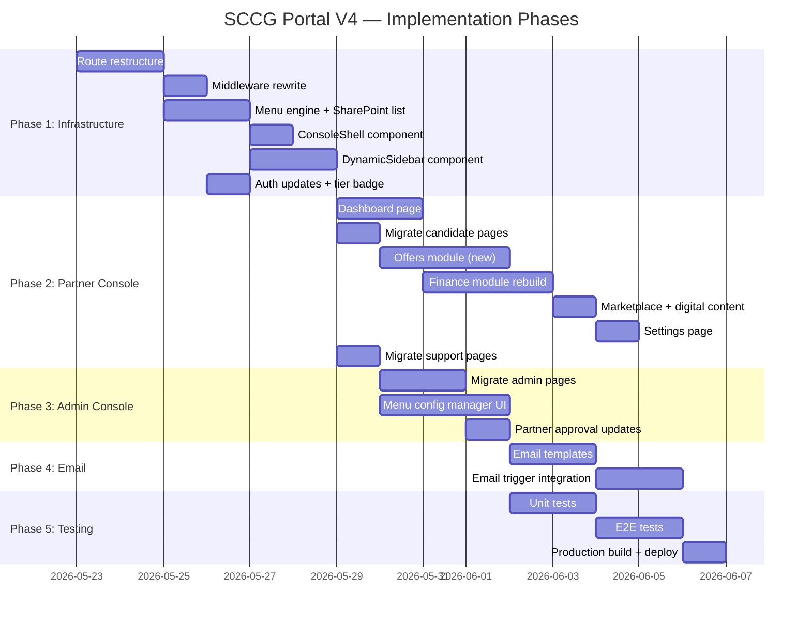

# SCCG Partner Portal — Master Plan V4
### Full System Rebuild: Role-Based Console Architecture
### Date: 23 May 2026

---

## Table of Contents

1. [Executive Summary](#1-executive-summary)
2. [Current State Analysis](#2-current-state-analysis)
3. [Target Architecture](#3-target-architecture)
4. [Phase 1: Core Infrastructure](#phase-1-core-infrastructure)
5. [Phase 2: Partner Console](#phase-2-partner-console)
6. [Phase 3: Admin Console](#phase-3-admin-console)
7. [Phase 4: Student Console](#phase-4-student-console)
8. [Phase 5: Email Integration (Office 365)](#phase-5-email-integration)
9. [Phase 6: Testing & Production Readiness](#phase-6-testing--production-readiness)
10. [Data Architecture](#data-architecture)
11. [Office 365 Outlook Requirements](#office-365-outlook-requirements)
12. [Detailed Task Breakdown](#detailed-task-breakdown)

---

## 1. Executive Summary

### What We're Building
A **multi-console portal system** where each user role gets a dedicated sub-path, navigation, and workflow experience — all sharing the same data sources (SharePoint + Firebase). An admin can dynamically add/remove menu items per role or per user (plug-and-play menu system).

### Key Architectural Decisions

| Decision | Choice | Reason |
|----------|--------|--------|
| URL Structure | `/partner/*`, `/admin/*`, `/student/*`, `/customer/*`, `/expert/*` | Clean role isolation, easy to identify content |
| Menu System | DB-driven (SharePoint `MenuConfig` list) | Admin can customize per role/user without code changes |
| Data Layer | SharePoint Lists + Firebase Auth (existing) | Already proven, no migration needed |
| Email | Microsoft Graph API (Office 365 direct) | Already partially built in `src/lib/email.ts` |
| Framework | Next.js 16 (existing) | Keep current stack |
| Fresh Build | **Incremental rebuild** — reuse data layer, rebuild UI consoles | Don't throw away working SharePoint/Firebase integrations |

### What Changes vs. What Stays

| Stays (Reuse) | Changes (Rebuild) |
|---|---|
| `src/lib/sharepoint.ts` — all CRUD ops | Route structure: `(portal)/` → `/partner/`, `/admin/` |
| `src/lib/graph.ts` — Graph client | Sidebar: hardcoded → DB-driven menu engine |
| `src/lib/email.ts` — email sending | Middleware: single portal → multi-console routing |
| `src/auth.ts` — Firebase + roles | Layout: single PortalShell → per-console shells |
| `src/types/index.ts` — data models | Dashboard: generic → role-specific consoles |
| SharePoint list schemas | New: `MenuConfig` list for dynamic menus |
| Firebase Auth setup | New: Admin menu management UI |

---

## 2. Current State Analysis

### What Works Well ✅
- Firebase Auth with multi-role support (`roles[]` array on session)
- SharePoint CRUD for 30+ entity types
- Partner candidate registration wizard (7 steps)
- Candidate workflow engine (4 categories × status flows)
- Commission/financial split engine
- Helpdesk ticket system
- Email via Microsoft Graph API

### What Needs Rework 🔄
- **Single portal shell** — all roles share `(portal)/` route group with one sidebar
- **Hardcoded menus** — 100+ links in `Sidebar.tsx` with role filtering
- **URL structure** — partners use `/partner/dashboard`, but it's under `(portal)/partner/`
- **Middleware routing** — basic role redirect, not console-aware
- **No admin menu management** — menus can only change via code

### Critical Gaps 🔴
- No dynamic menu configuration (admin plug-and-play)
- No `/partner` top-level route (currently nested under `(portal)`)
- No `/student` console at all
- No `/admin` dedicated console (admin pages are under `(portal)/admin/`)
- No offer creation flow in partner console
- No "Proud SCCG [Tier] Partner" branding per login

---

## 3. Target Architecture

### 3.1 URL Structure

```
portal.mysccg.de/
├── /login                    ← Universal login (role auto-detected)
├── /register                 ← Partner registration
├── /forgot-password          ← Password reset
│
├── /partner/                 ← PARTNER CONSOLE
│   ├── dashboard             ← Overview + KPIs
│   ├── candidates/           ← Candidate gallery
│   │   ├── new               ← Register candidate (7-step wizard)
│   │   └── [id]              ← Candidate detail + status tracking
│   ├── offers/               ← Create & manage client offers
│   │   ├── new               ← Create offer wizard
│   │   └── [id]              ← Offer detail
│   ├── tasks/                ← Auto-assigned task board
│   ├── finance/              ← Revenue, dues, invoices, payments
│   │   ├── revenue           ← My Revenue breakdown
│   │   ├── due-payments      ← Payments due to SCCG
│   │   ├── invoices          ← Create/manage invoices
│   │   ├── payments          ← Make payment to SCCG
│   │   └── refunds           ← Client refund requests
│   ├── marketplace/          ← SCCG products + digital content
│   ├── settings/             ← Profile, company, bank, notifications
│   └── support/              ← Ticket system
│
├── /admin/                   ← ADMIN CONSOLE
│   ├── dashboard             ← System overview
│   ├── partners/             ← Partner management + approvals
│   ├── candidates/           ← All candidates across partners
│   ├── users/                ← User management
│   ├── finance/              ← Full financial overview
│   ├── products/             ← Product/service management
│   ├── menu-config/          ← ⭐ Menu customization (plug-and-play)
│   ├── reports/              ← Analytics & reports
│   ├── helpdesk/             ← Support ticket management
│   └── settings/             ← System configuration
│
├── /student/                 ← STUDENT CONSOLE (future)
│   ├── dashboard
│   ├── courses/
│   ├── progress/
│   └── documents/
│
├── /customer/                ← CUSTOMER CONSOLE (existing, refactor)
│   ├── dashboard
│   ├── packages/
│   ├── sessions/
│   └── payments/
│
└── /expert/                  ← EXPERT CONSOLE (existing, refactor)
    ├── dashboard
    ├── clients/
    ├── sessions/
    └── payments/
```

### 3.2 Dynamic Menu Engine

```mermaid
graph TB
    subgraph "Menu Resolution Flow"
        LOGIN[User Logs In] --> SESSION[Session with roles[]]
        SESSION --> RESOLVER[Menu Resolver]
        RESOLVER --> DB_ROLE[Load MenuConfig for role]
        RESOLVER --> DB_USER[Load MenuConfig overrides for user]
        DB_ROLE --> MERGE[Merge: Role defaults + User overrides]
        DB_USER --> MERGE
        MERGE --> FINAL[Final Menu Items]
        FINAL --> SIDEBAR[Render Console Sidebar]
    end

    subgraph "Admin Menu Management"
        ADMIN[Admin Console] --> MENU_UI[Menu Config Page]
        MENU_UI --> ROLE_MENU[Edit Role Default Menus]
        MENU_UI --> USER_MENU[Edit User-Specific Menus]
        ROLE_MENU --> SP_LIST[SharePoint MenuConfig List]
        USER_MENU --> SP_LIST
    end
```

### 3.3 Menu Config Data Model

```typescript
// New SharePoint List: "MenuConfig"
interface MenuConfigItem {
  id: string;
  
  // Scope: "role" or "user"
  scope: "role" | "user";
  
  // For scope="role": which role this applies to
  roleTarget?: UserRole;  // "partner" | "admin" | "student" | "customer" | "expert"
  
  // For scope="user": which user (email or ID) this applies to
  userTarget?: string;
  
  // Menu item definition
  menuKey: string;          // Unique key: "partner.dashboard", "partner.candidates", etc.
  label: string;            // Display name: "Dashboard"
  href: string;             // Route: "/partner/dashboard"
  icon: string;             // Lucide icon name: "LayoutDashboard"
  group: string;            // Group label: "Main Console"
  groupOrder: number;       // Sort order of the group
  itemOrder: number;        // Sort order within group
  
  // Plug-and-play control
  isEnabled: boolean;       // Admin toggle on/off
  isDefault: boolean;       // Part of default role menu (true) or added extra (false)
  
  // Metadata
  createdAt: string;
  updatedAt?: string;
  createdBy: string;
}
```

### 3.4 Console Shell Architecture

```
┌─────────────────────────────────────────────────┐
│                  Root Layout                     │
│  (AuthContext, Fonts, Toaster)                   │
├─────────────────────────────────────────────────┤
│                                                  │
│  ┌──────────────┐  ┌──────────────────────────┐ │
│  │ Console Shell │  │                          │ │
│  │              │  │    Page Content            │ │
│  │  ┌────────┐  │  │                          │ │
│  │  │Dynamic │  │  │  (role-specific pages)    │ │
│  │  │Sidebar │  │  │                          │ │
│  │  │        │  │  │                          │ │
│  │  │Loaded  │  │  │                          │ │
│  │  │from DB │  │  │                          │ │
│  │  │        │  │  │                          │ │
│  │  └────────┘  │  │                          │ │
│  │              │  │                          │ │
│  │  Tier Badge  │  │                          │ │
│  │  User Info   │  │                          │ │
│  └──────────────┘  └──────────────────────────┘ │
│                                                  │
│  ┌──────────────────────────────────────────────┐│
│  │  Header: Search | Notifications | Profile    ││
│  └──────────────────────────────────────────────┘│
└─────────────────────────────────────────────────┘
```

Each console (`/partner`, `/admin`, `/student`, `/customer`, `/expert`) gets:
- Its own `layout.tsx` with role guard
- A shared `<ConsoleShell>` component that takes `console: string` prop
- Dynamic sidebar loaded from `MenuConfig` list
- Console-specific theming (tier badge for partners, etc.)

---

## Phase 1: Core Infrastructure
**Estimated Scope: Foundation for all consoles**

### 1.1 Route Restructure

| Task | Description | Files |
|------|-------------|-------|
| 1.1.1 | Create top-level route groups: `src/app/partner/`, `src/app/admin/` | New directories |
| 1.1.2 | Move existing `(portal)/partner/*` pages to `src/app/partner/` | Move files |
| 1.1.3 | Move existing `(portal)/admin/*` pages to `src/app/admin/` | Move files |
| 1.1.4 | Create `src/app/student/` placeholder | New directory |
| 1.1.5 | Keep `customer/` and `expert/` as-is (already top-level) | No change |
| 1.1.6 | Remove `(portal)/` route group (migrate remaining shared pages) | Delete |

### 1.2 Middleware Rewrite

```typescript
// New middleware logic (src/proxy.ts)
const CONSOLE_ROUTES = {
  "/partner": ["partner", "partner-individual", "partner-institutional"],
  "/admin":   ["admin"],
  "/student": ["student"],
  "/customer":["customer"],
  "/expert":  ["expert", "teacher"],
};

// On login → redirect to /{primaryRole}/dashboard
// On access → verify user.roles includes required role for the console path
// On unauthorized → redirect to login with error
```

### 1.3 Dynamic Menu System

| Task | Description |
|------|-------------|
| 1.3.1 | Create `MenuConfig` SharePoint list schema + setup script |
| 1.3.2 | Add CRUD functions to `sharepoint.ts`: `getMenuConfig()`, `updateMenuItem()`, etc. |
| 1.3.3 | Create `src/lib/menu-engine.ts` — resolves menu for user (role defaults + user overrides) |
| 1.3.4 | Seed default menu items for each role (from current hardcoded `allLinks`) |
| 1.3.5 | Create `<DynamicSidebar>` component replacing hardcoded `<Sidebar>` |
| 1.3.6 | Create `<ConsoleShell>` shared layout component |

### 1.4 Console Shell Components

```typescript
// src/components/layout/ConsoleShell.tsx
interface ConsoleShellProps {
  console: "partner" | "admin" | "student" | "customer" | "expert";
  user: SessionUser;
  children: React.ReactNode;
}

// Loads menu from MenuConfig, renders DynamicSidebar + Header
```

### 1.5 Auth Updates

| Task | Description |
|------|-------------|
| 1.5.1 | Update login redirect: detect primary role → redirect to `/{role}/dashboard` |
| 1.5.2 | Add `primaryConsole` to session (computed from roles priority) |
| 1.5.3 | Add "Proud SCCG [Tier] Partner" badge to partner session data |

---

## Phase 2: Partner Console
**The first console to fully implement in the new architecture**

### 2.1 Dashboard — Main Console (`/partner/dashboard`)

```
┌─────────────────────────────────────────────────────────┐
│  🏅 Proud SCCG Gold Partner                             │
├───────────────────────┬─────────────────────────────────┤
│                       │                                  │
│  📊 Overview          │  💰 My Revenue                   │
│  ┌─────┐ ┌─────┐     │  ┌──────────────────────────┐   │
│  │Total│ │Succ.│     │  │ Total Earnings: €12,500  │   │
│  │  24 │ │  18 │     │  │ Paid: €8,000             │   │
│  └─────┘ └─────┘     │  │ Pending: €4,500          │   │
│  ┌─────┐ ┌─────┐     │  │ SCCG Share: €37,500      │   │
│  │Pend.│ │Drop │     │  │ Partner Share: €12,500   │   │
│  │   4 │ │   2 │     │  │ ┌────────────────────┐   │   │
│  └─────┘ └─────┘     │  │ │ Revenue Graph ▓▓▓░ │   │   │
│                       │  │ └────────────────────┘   │   │
├───────────────────────┴─────────────────────────────────┤
│  ✅ My Tasks                                             │
│  ┌──────────┬──────────┬──────────┐                     │
│  │📄 Docs   │💸 Payment│📌 General│                     │
│  │ Required │  Due     │  Tasks   │                     │
│  │          │          │          │                     │
│  │ Ahmed K. │ Rahim S. │ Update   │                     │
│  │ Upload CV│ €500 due │ profile  │                     │
│  │ Due: 3d  │ Due: 7d  │ Due: 1d  │                     │
│  └──────────┴──────────┴──────────┘                     │
└─────────────────────────────────────────────────────────┘
```

#### Dashboard Data Sources (all existing in SharePoint)
- `getCandidates(partnerId)` → active/success/pending/dropout counts
- `getCandidateTasksByPartner(partnerId)` → tasks by category
- `getPayouts(partnerId)` → revenue calculations
- `getInvoices(partnerId)` → pending payments
- Partner session data → tier badge

### 2.2 Candidate Gallery (`/partner/candidates`)

#### Already Built ✅ (reuse from `(portal)/partner/candidates/`)
- Candidate list table with filters
- 7-step registration wizard (Step1–Step7)
- Candidate detail page with status advancer
- Document upload section
- Service purchase drawer

#### Needs Addition 🔄
| Feature | Status | Work Needed |
|---------|--------|-------------|
| Candidate list with search/filter | ✅ Exists | Move to new route |
| 7-step registration wizard | ✅ Exists | Move to new route |
| Status workflow tracking (4 categories) | ✅ Exists | Move to new route |
| Document upload | ✅ Exists | Move to new route |
| Auto pricing display (Step 4) | ✅ Exists | Verify logic |
| Payment options (Pay Now / Pay Later) | ⚠️ Partial | Add online payment gateway stub |
| Submission ID generation | ✅ Exists (`sccgId`) | Verify |

### 2.3 Create Offer (`/partner/offers`)

#### New Feature — Build from existing Sales module
| Component | Source | Work |
|-----------|--------|------|
| Offer list page | Adapt from `(portal)/sales/offers/` | New page |
| Create offer wizard | Adapt from `(portal)/sales/` | New page |
| Offer PDF generation | `jspdf` already in dependencies | Integrate |
| Email offer to client | `src/lib/email.ts` already works | Connect |
| Partner + SCCG branding | New | Design template |
| Pricing breakdown display | Existing commission engine | Connect |

### 2.4 Client Progress / Status Tracking (`/partner/candidates/[id]`)

#### Already Built ✅ — Workflow Engine
The 4-category workflow system is **fully defined** in types:
- `TrainingStatus` (4 steps)
- `AusbildungStatus` (9 steps)  
- `StudentVisaStatus` (8 steps)
- `OpportunityCardStatus` (10 steps)

The `CandidateStatusAdvancer` component exists. **Reuse as-is.**

### 2.5 Finance Module (`/partner/finance`)

| Page | Route | Data Source | Status |
|------|-------|-------------|--------|
| My Revenue | `/partner/finance/revenue` | `getPayouts(partnerId)` + aggregation | 🔄 Rebuild |
| Due Payments | `/partner/finance/due-payments` | `getInvoices(partnerId, status="pending")` | 🔄 Rebuild |
| Create Invoice | `/partner/finance/invoices` | `createInvoice()` + PDF gen | ⚠️ Partial |
| Make Payment | `/partner/finance/payments` | New payment recording flow | 🆕 New |
| Refund Request | `/partner/finance/refunds` | New refund workflow | 🆕 New |

#### Revenue Breakdown Logic (existing data)
```
Total Earnings = SUM(candidate.partnerShare) WHERE partnerId = session.partnerId
Paid = SUM(payouts WHERE status = "paid")
Pending = Total Earnings - Paid
SCCG Share = SUM(candidate.sccgShare)
Partner Share = SUM(candidate.partnerShare)
```

### 2.6 Marketplace (`/partner/marketplace`)

| Feature | Status |
|---------|--------|
| Products listing | ✅ Exists (`getProducts()`) |
| Pricing display | ✅ Exists |
| Add to candidate registration | ✅ Exists (Step 3 wizard) |
| Digital content (PDFs, brochures) | 🆕 New — add `contentType` filter |
| Marketing assets | 🆕 New — add asset download section |

### 2.7 Account Settings (`/partner/settings`)

| Feature | Status |
|---------|--------|
| Profile management | ✅ Exists (`/profile`) |
| Company info | ⚠️ Partial (on Partner record) |
| Bank details | 🆕 New field on Partner |
| Password change | ✅ Exists (Firebase Auth) |
| Notification settings | 🆕 New — preferences stored in SharePoint |

### 2.8 Support / Raise a Question (`/partner/support`)

#### Already Built ✅
- Ticket creation with category + priority
- Ticket detail with message thread
- Reply form
- Status tracking (open → in-progress → resolved → closed)

**Reuse from `(portal)/partner/support/` as-is.**

---

## Phase 3: Admin Console

### 3.1 Menu Configuration Manager (`/admin/menu-config`) ⭐ KEY FEATURE

```
┌─────────────────────────────────────────────────────────┐
│  ⚙️ Menu Configuration                                  │
├─────────────────────────────────────────────────────────┤
│  Tabs: [By Role] [By User] [Available Items]            │
│                                                          │
│  ┌──────────────────────────────────────────────────┐   │
│  │ Role: Partner ▼                                    │   │
│  │                                                    │   │
│  │ ✅ Dashboard          /partner/dashboard       🔒  │   │
│  │ ✅ Candidates         /partner/candidates      🔒  │   │
│  │ ✅ Offers             /partner/offers              │   │
│  │ ✅ Tasks              /partner/tasks               │   │
│  │ ✅ Finance            /partner/finance             │   │
│  │ ☐  Reports            /partner/reports         +   │   │
│  │ ✅ Marketplace        /partner/marketplace         │   │
│  │ ✅ Settings           /partner/settings            │   │
│  │ ✅ Support            /partner/support             │   │
│  │                                                    │   │
│  │ 🔒 = Locked (cannot be removed from role)          │   │
│  │ + = Add to this role                               │   │
│  └──────────────────────────────────────────────────┘   │
│                                                          │
│  [Save Changes]  [Reset to Defaults]                    │
└─────────────────────────────────────────────────────────┘
```

**Admin can:**
- Toggle menu items on/off per role
- Add extra menu items to specific roles
- Override menu for a specific user (user-level overrides)
- Lock critical items (dashboard, candidates) so they can't be removed
- Drag to reorder menu items

### 3.2 Other Admin Pages (migrate existing)

| Current Path | New Path | Status |
|---|---|---|
| `(portal)/admin/partners` | `/admin/partners` | Move |
| `(portal)/admin/candidates` | `/admin/candidates` | Move |
| `(portal)/admin/users` | `/admin/users` | Move |
| `(portal)/admin/financials` | `/admin/finance` | Move |
| `(portal)/admin/products` | `/admin/products` | Move |
| `(portal)/admin/helpdesk` | `/admin/helpdesk` | Move |
| `(portal)/admin/reports` | `/admin/reports` | Move |
| `(portal)/admin/commission-rules` | `/admin/commission-rules` | Move |
| New | `/admin/menu-config` | 🆕 Build |
| New | `/admin/email-templates` | 🆕 Build |

---

## Phase 4: Student Console
**(Future — placeholder structure only in Phase 1)**

Route: `/student/*`
- Dashboard: enrollment status, course progress
- Courses: enrolled courses, materials
- Progress: grade tracking, certificates
- Documents: uploaded documents, certificates

---

## Phase 5: Email Integration (Office 365)

### 5.1 Current State
- `src/lib/email.ts` already sends email via Microsoft Graph API
- Uses `POST /users/{senderId}/sendMail`
- Requires: `O365_SENDER_USER_ID` env var (the mailbox to send from)

### 5.2 What's Needed from You (Office 365 Setup)

To enable **full send + receive** email integration:

#### For SENDING emails from the portal:

| Requirement | Value Needed | Description |
|---|---|---|
| `AZURE_AD_TENANT_ID` | `xxxxxxxx-xxxx-...` | Your Microsoft 365 tenant ID |
| `AZURE_AD_CLIENT_ID` | `xxxxxxxx-xxxx-...` | Azure AD App Registration client ID |
| `AZURE_AD_CLIENT_SECRET` | `xxxxxxxxx` | App Registration secret |
| `O365_SENDER_USER_ID` | `user@mysccg.de` or Object ID | The mailbox to send emails FROM |
| **API Permission** | `Mail.Send` (Application) | Grant in Azure AD → App → API Permissions |

#### For RECEIVING emails (reading inbox):

| Requirement | Value Needed | Description |
|---|---|---|
| **API Permission** | `Mail.Read` (Application) | Read emails from shared mailbox |
| **API Permission** | `Mail.ReadWrite` (Application) | Mark as read, move, archive |
| Shared Mailbox | `support@mysccg.de` | (Optional) Shared mailbox for helpdesk |

#### For Calendar/Meeting integration (optional):

| Requirement | Value Needed | Description |
|---|---|---|
| **API Permission** | `Calendars.ReadWrite` | Create/manage meetings |

### 5.3 Azure AD App Registration Steps

```
1. Go to Azure Portal → Azure Active Directory → App Registrations
2. Create new registration (or use existing)
3. Add API Permissions:
   - Microsoft Graph → Application Permissions:
     ✅ Mail.Send
     ✅ Mail.Read  
     ✅ Mail.ReadWrite
     ✅ User.Read.All (for user lookup)
   - Click "Grant admin consent"
4. Create Client Secret → copy value
5. Note the Application (client) ID and Tenant ID
6. Provide these values for .env configuration
```

### 5.4 Email Features to Implement

| Feature | Trigger | Template |
|---|---|---|
| Welcome Partner | Admin approves partner | Partner name, tier, login link |
| Candidate Registered | Partner submits candidate | Candidate name, ID, status |
| Status Update | Status advances | Candidate name, old → new status |
| Payment Confirmation | Payment recorded | Amount, reference, balance |
| Invoice Created | Auto or manual | Invoice details, PDF attachment |
| Task Assigned | Auto from workflow | Task details, deadline, action link |
| Offer Sent | Partner creates offer | Offer PDF, accept/reject links |
| Ticket Response | Staff replies to ticket | Ticket subject, message preview |

---

## Phase 6: Testing & Production Readiness

### 6.1 Testing Strategy

| Layer | Tool | Coverage Target |
|---|---|---|
| Unit Tests | Vitest | Menu engine, financial calculations, workflow logic |
| Component Tests | Vitest + React Testing Library | Dashboard cards, sidebar, wizard steps |
| Integration Tests | Vitest | SharePoint CRUD, email sending |
| E2E Tests | Playwright | Login → dashboard → register candidate → full flow |
| API Tests | Vitest | All server actions, API routes |

### 6.2 E2E Test Scenarios

```
Test Suite: Partner Console
├── TC-001: Partner login → redirect to /partner/dashboard
├── TC-002: Dashboard shows correct KPIs (candidates, revenue, tasks)
├── TC-003: Register new candidate (7-step wizard)
├── TC-004: Candidate status advances through workflow
├── TC-005: Create offer for candidate
├── TC-006: View revenue breakdown
├── TC-007: Create and submit helpdesk ticket
├── TC-008: Menu items match role configuration

Test Suite: Admin Console
├── TC-101: Admin login → redirect to /admin/dashboard
├── TC-102: Approve pending partner → partner gets access
├── TC-103: Configure menu items for partner role
├── TC-104: Add menu item override for specific user
├── TC-105: Partner sees updated menu after admin change

Test Suite: Dynamic Menu
├── TC-201: Default menu loads for new partner
├── TC-202: Admin disables menu item → partner doesn't see it
├── TC-203: Admin adds extra menu item → partner sees it
├── TC-204: User-specific override takes precedence over role default
```

### 6.3 Production Checklist

- [ ] All env vars configured (Azure AD, Firebase, SharePoint)
- [ ] SharePoint lists created (`MenuConfig` + verify existing)
- [ ] Default menu seeds loaded
- [ ] Email templates verified with real O365 mailbox
- [ ] Docker build passes
- [ ] Playwright E2E suite passes
- [ ] Performance: dashboard loads < 2s
- [ ] Security: role checks on every server action
- [ ] Mobile responsive: all console pages

---

## Data Architecture

### New SharePoint Lists Required

#### 1. MenuConfig (NEW)
| Column | Type | Description |
|---|---|---|
| scope | Choice | "role" or "user" |
| roleTarget | Text | Role name if scope=role |
| userTarget | Text | User email if scope=user |
| menuKey | Text | Unique key: "partner.dashboard" |
| label | Text | Display label |
| href | Text | Route path |
| icon | Text | Lucide icon name |
| groupName | Text | Group label |
| groupOrder | Number | Group sort order |
| itemOrder | Number | Item sort within group |
| isEnabled | Boolean | Toggle on/off |
| isDefault | Boolean | Default role item (non-removable) |
| isLocked | Boolean | Cannot be disabled by admin |

#### 2. PartnerBankDetails (NEW)
| Column | Type | Description |
|---|---|---|
| partnerId | Text | FK to Partners |
| bankName | Text | Bank name |
| accountHolder | Text | Account holder name |
| iban | Text | IBAN |
| bic | Text | BIC/SWIFT |
| currency | Choice | EUR / BDT |

#### 3. NotificationPreferences (NEW)
| Column | Type | Description |
|---|---|---|
| userId | Text | User email or ID |
| emailOnTaskAssigned | Boolean | |
| emailOnStatusChange | Boolean | |
| emailOnPayment | Boolean | |
| emailOnTicketReply | Boolean | |

### Existing Lists (No Schema Changes Needed)
- ✅ Partners — has `tierStatus`, `marginPercentage`, `partnerType`
- ✅ Candidates — has full workflow fields
- ✅ CandidateServices — linked to candidates
- ✅ CandidateTasks — task categories + workflow link
- ✅ Products — full product catalog
- ✅ Invoices — billing records
- ✅ Payouts — commission payouts
- ✅ CommissionRules — auto commission logic
- ✅ CommissionLedger — transaction history
- ✅ HelpdeskTickets — support tickets
- ✅ HelpdeskMessages — ticket messages
- ✅ ServicePricings — pricing catalog

---

## Office 365 Outlook Requirements

### Information Needed From You

Please provide the following to enable Office 365 email integration:

```
┌─────────────────────────────────────────────────────┐
│  OFFICE 365 CONNECTOR SETUP — REQUIRED VALUES       │
├─────────────────────────────────────────────────────┤
│                                                      │
│  1. Azure AD Tenant ID:     ___________________     │
│     (Found in Azure Portal → Azure AD → Overview)   │
│                                                      │
│  2. App Registration Client ID: _______________     │
│     (Azure AD → App Registrations → your app)       │
│                                                      │
│  3. App Registration Client Secret: ___________     │
│     (Certificates & Secrets → New client secret)    │
│                                                      │
│  4. Sender Email Address: _____________________     │
│     e.g., noreply@mysccg.de or info@mysccg.de      │
│     (Must be a licensed M365 mailbox)               │
│                                                      │
│  5. Support Mailbox (optional): _______________     │
│     e.g., support@mysccg.de                         │
│     (For helpdesk email threading)                  │
│                                                      │
│  6. API Permissions granted:                        │
│     ☐ Mail.Send (Application)                       │
│     ☐ Mail.Read (Application) — if reading inbox    │
│     ☐ Mail.ReadWrite (Application) — if managing    │
│     ☐ Admin consent granted                         │
│                                                      │
│  NOTE: You may already have #1-#3 configured.       │
│  Check your current .env file for:                  │
│  AZURE_AD_TENANT_ID, AZURE_AD_CLIENT_ID,            │
│  AZURE_AD_CLIENT_SECRET                              │
│                                                      │
└─────────────────────────────────────────────────────┘
```

---

## Detailed Task Breakdown

### Implementation Order (Recommended)



### Task Checklist

#### Phase 1: Core Infrastructure (6 tasks)
- [ ] **1.1** Create route directories: `/partner`, `/admin`, `/student` with layout.tsx files
- [ ] **1.2** Rewrite middleware (`proxy.ts`) for multi-console routing
- [ ] **1.3** Build `MenuConfig` SharePoint list + CRUD functions + seed script
- [ ] **1.4** Build `src/lib/menu-engine.ts` (resolve menus for user)
- [ ] **1.5** Build `<ConsoleShell>` + `<DynamicSidebar>` components
- [ ] **1.6** Update auth to add `primaryConsole` + tier badge to session

#### Phase 2: Partner Console (7 tasks)
- [ ] **2.1** Build Partner Dashboard (`/partner/dashboard`) with KPI cards + revenue + tasks
- [ ] **2.2** Migrate candidate pages (list, wizard, detail, status tracking)
- [ ] **2.3** Build Offers module (`/partner/offers`) — create, list, PDF, email
- [ ] **2.4** Build Finance module — revenue, due payments, invoices, make payment, refunds
- [ ] **2.5** Build Marketplace page with digital content section
- [ ] **2.6** Build Settings page (profile, company, bank, notifications)
- [ ] **2.7** Migrate Support/Helpdesk pages

#### Phase 3: Admin Console (3 tasks)
- [ ] **3.1** Migrate all admin pages to `/admin/*`
- [ ] **3.2** Build Menu Configuration Manager (`/admin/menu-config`)
- [ ] **3.3** Update partner approval flow with tier/margin assignment

#### Phase 4: Email Integration (2 tasks)
- [ ] **4.1** Create HTML email templates for all trigger events
- [ ] **4.2** Wire email triggers into candidate workflow + finance actions

#### Phase 5: Testing & Production (3 tasks)
- [ ] **5.1** Write unit tests for menu engine, financial calculations, workflow logic
- [ ] **5.2** Write E2E tests for partner console full flow
- [ ] **5.3** Docker build, production optimization, deployment

---

## Key Automation Features (Built Into Architecture)

| Feature | Implementation | Status |
|---|---|---|
| Auto task generation | `CandidateTask` created on status change | ✅ Types exist |
| Auto pricing calculation | `ServicePricing` lookup in wizard Step 4 | ✅ Built |
| Auto commission split | `marginPercentage` × `totalServiceFee` | ✅ Built |
| Auto status update | `advanceCandidateStatus()` in SharePoint | ✅ Built |
| Auto document validation | Upload required before Step 7 submit | ✅ Built |
| Auto invoice generation | `createInvoice()` + jsPDF | ⚠️ Partial |
| Auto email notifications | Graph API `sendMail` on triggers | ⚠️ Partial |

---

## Summary: What To Build vs. What To Reuse

### Reuse (move to new routes)
- ✅ 7-step candidate registration wizard (7 components)
- ✅ Candidate status advancer component
- ✅ Document upload section
- ✅ Helpdesk ticket system (4 components)
- ✅ Task board (kanban)
- ✅ Finance ledger client
- ✅ All SharePoint CRUD functions
- ✅ All data type definitions
- ✅ Auth system (Firebase + multi-role)
- ✅ Email sending via Graph API

### Build New
- 🆕 `<ConsoleShell>` + `<DynamicSidebar>` components
- 🆕 `MenuConfig` SharePoint list + engine
- 🆕 Admin Menu Configuration Manager UI
- 🆕 Partner Dashboard with KPI cards
- 🆕 Partner Offers module
- 🆕 Partner Finance pages (revenue, payments, refunds)
- 🆕 Rewritten middleware for multi-console routing
- 🆕 Email templates + trigger wiring
- 🆕 Bank details management
- 🆕 Notification preferences

---

## Next Steps

**Ready to start?** Say which phase to begin with. Recommended order:

1. **Phase 1.1–1.2** — Route restructure + middleware (foundation)
2. **Phase 1.3–1.5** — Menu engine + ConsoleShell (shared components)
3. **Phase 2.1** — Partner Dashboard (first visible result)
4. **Phase 2.2–2.7** — Remaining partner pages
5. **Phase 3** — Admin console + menu manager
6. **Phase 4–5** — Email + testing

Each phase is independently deployable. Partner console can go live while admin features are still being built.
